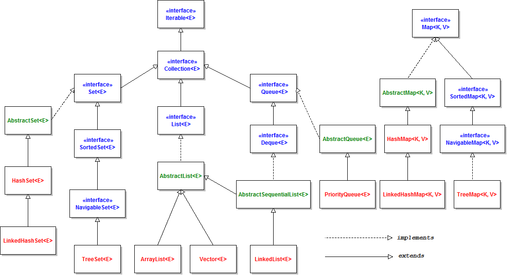

The Java Collections Framework is a unified architecture for representing and manipulating collections of objects. It contains interfaces, implementations, and algorithms that allow developers to work with collections efficiently.

## Collection Hierarchy



## Core Interfaces

### Collection

The root interface in the collection hierarchy. A collection represents a group of objects, known as its elements.

```java
public interface Collection<E> extends Iterable<E> {
    // Basic Operations
    boolean add(E e);
    boolean remove(Object o);
    boolean contains(Object o);
    int size();
    boolean isEmpty();
    void clear();
    
    // Bulk Operations
    boolean addAll(Collection<? extends E> c);
    boolean removeAll(Collection<?> c);
    boolean retainAll(Collection<?> c);
    boolean containsAll(Collection<?> c);
    
    // Array Operations
    Object[] toArray();
    <T> T[] toArray(T[] a);
    
    // Java 8 additions
    default Stream<E> stream() { /* ... */ }
    default Stream<E> parallelStream() { /* ... */ }
}
```

### List

An ordered collection (sequence) that allows duplicate elements.

```java
public interface List<E> extends Collection<E> {
    // Positional Access
    E get(int index);
    E set(int index, E element);
    void add(int index, E element);
    E remove(int index);
    
    // Search
    int indexOf(Object o);
    int lastIndexOf(Object o);
    
    // List Iteration
    ListIterator<E> listIterator();
    ListIterator<E> listIterator(int index);
    
    // View
    List<E> subList(int fromIndex, int toIndex);
}
```

### Set

A collection that cannot contain duplicate elements.

```java
public interface Set<E> extends Collection<E> {
    // Inherits methods from Collection
    // No additional methods, but guarantees no duplicates
}
```

### Queue

A collection designed for holding elements prior to processing. Typically ordered in FIFO (first-in-first-out).

```java
public interface Queue<E> extends Collection<E> {
    // Inserts
    boolean offer(E e);  // Preferred over add() for capacity-restricted queues
    
    // Retrieval
    E peek();  // Returns null if queue is empty
    E element();  // Throws NoSuchElementException if queue is empty
    
    // Removal
    E poll();  // Returns null if queue is empty
    E remove();  // Throws NoSuchElementException if queue is empty
}
```

### Deque

A double-ended queue that supports element insertion and removal at both ends.

```java
public interface Deque<E> extends Queue<E> {
    // First element (head) operations
    void addFirst(E e);
    void offerFirst(E e);
    E removeFirst();
    E pollFirst();
    E getFirst();
    E peekFirst();
    
    // Last element (tail) operations
    void addLast(E e);
    void offerLast(E e);
    E removeLast();
    E pollLast();
    E getLast();
    E peekLast();
}
```

### Map

An object that maps keys to values. A map cannot contain duplicate keys.

```java
public interface Map<K, V> {
    // Basic Operations
    V put(K key, V value);
    V get(Object key);
    V remove(Object key);
    boolean containsKey(Object key);
    boolean containsValue(Object value);
    int size();
    boolean isEmpty();
    void clear();
    
    // Bulk Operations
    void putAll(Map<? extends K, ? extends V> m);
    
    // Collection Views
    Set<K> keySet();
    Collection<V> values();
    Set<Map.Entry<K, V>> entrySet();
    
    // Java 8 additions
    default V getOrDefault(Object key, V defaultValue) { /* ... */ }
    default void forEach(BiConsumer<? super K, ? super V> action) { /* ... */ }
    default V computeIfAbsent(K key, Function<? super K, ? extends V> mappingFunction) { /* ... */ }
    // ... and more
    
    // Nested interface for map entries
    interface Entry<K, V> {
        K getKey();
        V getValue();
        V setValue(V value);
    }
}
```

## Key Implementations

### List Implementations

#### ArrayList

A resizable array implementation of the List interface.

**Internal Structure:**
- Backed by an array that grows dynamically
- Initial capacity is 10 (default constructor)
- When capacity is reached, grows by approximately 50% (1.5 times)

**Performance:**
- `get(int index)`, `set(int index, E)`: O(1)
- `add(E)` (at end): Amortized O(1)
- `add(int index, E)`: O(n)
- `remove(int index)`, `remove(Object)`: O(n)
- Memory overhead: Low

**Use When:**
- Random access is frequent
- Insertion/deletion at the end is frequent
- Size of list changes frequently

```java
List<String> arrayList = new ArrayList<>();
arrayList.add("Apple");  // O(1) amortized
arrayList.add("Banana");
arrayList.add("Cherry");

String second = arrayList.get(1);  // O(1)
arrayList.set(1, "Blueberry");  // O(1)

arrayList.add(0, "Apricot");  // O(n) - shifts all elements
arrayList.remove(2);  // O(n) - shifts subsequent elements
```

#### LinkedList

A doubly-linked list implementation of the List and Deque interfaces.

**Internal Structure:**
- Doubly-linked list with references to first and last nodes
- Each node contains: previous node reference, element, next node reference

**Performance:**
- `get(int index)`, `set(int index, E)`: O(n) - must traverse from beginning or end
- `add(E)` (at end): O(1)
- `add(int index, E)`: O(n) to find position, then O(1) to insert
- `remove(int index)`, `remove(Object)`: O(n) to find, then O(1) to remove
- Memory overhead: Higher (node objects with references)

**Use When:**
- Frequent insertions/deletions in the middle
- Implementing a queue or deque
- No random access needed

```java
LinkedList<String> linkedList = new LinkedList<>();
linkedList.add("Apple");  // O(1)
linkedList.add("Banana");
linkedList.add("Cherry");

// LinkedList-specific operations (from Deque interface)
linkedList.addFirst("Apricot");  // O(1)
linkedList.addLast("Date");  // O(1)
String first = linkedList.removeFirst();  // O(1)
String last = linkedList.removeLast();  // O(1)

// List operations - less efficient
String middle = linkedList.get(1);  // O(n)
linkedList.set(1, "Blueberry");  // O(n)
```

#### Vector

A synchronized, legacy implementation of a growable array-backed list.

**Key Characteristics:**
- Thread-safe (all methods synchronized)
- Similar to ArrayList but with synchronization overhead
- Grows by doubling size when capacity is reached (unlike ArrayList's 50%)

**Use When:**
- Thread safety is required and you can't use Collections.synchronizedList()
- Legacy code integration

```java
Vector<String> vector = new Vector<>();
vector.add("Apple");  // Thread-safe
vector.add("Banana");
vector.elementAt(0);  // Legacy method, equivalent to get(0)
```

#### Stack

A legacy LIFO (last-in-first-out) stack implementation extending Vector.

**Key Characteristics:**
- Thread-safe (inherits from Vector)
- Represents a last-in-first-out (LIFO) stack
- Considered legacy; Deque implementations preferred for new code

**Use When:**
- Legacy code integration
- For new code, use ArrayDeque instead

```java
Stack<String> stack = new Stack<>();
stack.push("Apple");  // Add to top
stack.push("Banana");
String top = stack.peek();  // View top without removing
String popped = stack.pop();  // Remove and return top
boolean empty = stack.empty();  // Check if empty
```


### Set Implementations

#### HashSet

A Set implementation backed by a HashMap, with no guaranteed iteration order.

**Internal Structure:**
- Backed by HashMap where elements are stored as keys with a dummy value
- Uses element's hashCode() and equals() methods
- [Java HashSet Internal Working](https://javaconceptoftheday.com/how-hashset-works-internally-in-java/)

**Performance:**
- `add(E)`, `remove(Object)`, `contains(Object)`: O(1) average case
- Iteration: O(capacity + size)
- Memory overhead: Higher than TreeSet due to hash table

**Use When:**
- Fast insertion, removal, and lookup
- No need for ordering
- Elements have good hash functions

```java
Set<String> hashSet = new HashSet<>();
hashSet.add("Apple");  // O(1) average
hashSet.add("Banana");
hashSet.add("Apple");  // Duplicate, not added

boolean contains = hashSet.contains("Cherry");  // O(1) average
hashSet.remove("Banana");  // O(1) average

// Iteration order is not guaranteed
for (String fruit : hashSet) {
    System.out.println(fruit);
}
```

#### LinkedHashSet

A HashSet with predictable iteration order (insertion order).

**Internal Structure:**
- Extends HashSet but maintains a doubly-linked list of entries
- Preserves insertion order during iteration
- [How LinkedHashSet Works Internally In Java?](https://javaconceptoftheday.com/how-linkedhashset-works-internally-in-java/) 

**Performance:**
- `add(E)`, `remove(Object)`, `contains(Object)`: O(1) average case
- Iteration: O(size) - faster than HashSet
- Memory overhead: Higher than HashSet due to linked list

**Use When:**
- Need HashSet performance with predictable iteration order
- Want to maintain insertion order

```java
Set<String> linkedHashSet = new LinkedHashSet<>();
linkedHashSet.add("Cherry");
linkedHashSet.add("Apple");
linkedHashSet.add("Banana");

// Iteration order is insertion order: Cherry, Apple, Banana
for (String fruit : linkedHashSet) {
    System.out.println(fruit);
}
```

#### TreeSet

A NavigableSet implementation backed by a TreeMap, sorted according to natural ordering or a comparator.

**Internal Structure:**
- Implemented as a Red-Black Tree
- Elements must be comparable (implement Comparable or provide a Comparator)

**Performance:**
- `add(E)`, `remove(Object)`, `contains(Object)`: O(log n)
- Iteration: O(n) in sorted order
- Memory overhead: Lower than HashSet

**Use When:**
- Elements need to be sorted
- Need range-view operations
- Need to find closest matches

```java
TreeSet<String> treeSet = new TreeSet<>();
treeSet.add("Cherry");
treeSet.add("Apple");
treeSet.add("Banana");

// Iteration in natural order: Apple, Banana, Cherry
for (String fruit : treeSet) {
    System.out.println(fruit);
}

// NavigableSet operations
String first = treeSet.first();  // "Apple"
String last = treeSet.last();  // "Cherry"
String higher = treeSet.higher("Banana");  // "Cherry" (next higher)
String lower = treeSet.lower("Banana");  // "Apple" (next lower)
Set<String> subset = treeSet.subSet("Apple", "Cherry");  // Range view
```

#### EnumSet

A specialized Set implementation for enum types.

**Internal Structure:**
- Extremely compact and efficient bit vector implementation
- Can represent an enum value in a single bit

**Performance:**
- All basic operations: O(1)
- Very low memory footprint

**Use When:**
- Working with enum values
- Need high performance set operations on enums

```java
enum Day { MONDAY, TUESDAY, WEDNESDAY, THURSDAY, FRIDAY, SATURDAY, SUNDAY }

// Create a set with specific elements
EnumSet<Day> weekdays = EnumSet.of(Day.MONDAY, Day.TUESDAY, Day.WEDNESDAY, 
                                 Day.THURSDAY, Day.FRIDAY);

// Create a set with a range
EnumSet<Day> weekend = EnumSet.range(Day.SATURDAY, Day.SUNDAY);

// Create a set with all enum values
EnumSet<Day> allDays = EnumSet.allOf(Day.class);

// Create a set with complement of another set
EnumSet<Day> notWeekdays = EnumSet.complementOf(weekdays);  // Same as weekend
```

### Queue Implementations

#### PriorityQueue

An unbounded priority queue based on a priority heap, ordered by natural ordering or a comparator.

**Internal Structure:**
- Implemented as a binary heap (complete binary tree)
- Default is min-heap (smallest element first)

**Performance:**
- `offer(E)`, `add(E)`: O(log n)
- `peek()`, `element()`: O(1)
- `poll()`, `remove()`: O(log n)
- `remove(Object)`, `contains(Object)`: O(n)

**Use When:**
- Need to process elements by priority
- Implementing algorithms like Dijkstra's or Prim's

```java
// Natural ordering
PriorityQueue<Integer> minHeap = new PriorityQueue<>();
minHeap.offer(5);
minHeap.offer(2);
minHeap.offer(8);
minHeap.offer(1);

// Elements come out in priority order
while (!minHeap.isEmpty()) {
    System.out.println(minHeap.poll());  // Prints: 1, 2, 5, 8
}

// Custom comparator (max heap)
PriorityQueue<Integer> maxHeap = new PriorityQueue<>(Comparator.reverseOrder());
maxHeap.addAll(Arrays.asList(5, 2, 8, 1));

while (!maxHeap.isEmpty()) {
    System.out.println(maxHeap.poll());  // Prints: 8, 5, 2, 1
}
```

#### ArrayDeque

A resizable-array implementation of the Deque interface with no capacity restrictions.

**Internal Structure:**
- Circular array with head and tail pointers
- More efficient than LinkedList for most queue/stack operations

**Performance:**
- All basic operations (add/remove at both ends): O(1)
- Random access: Not supported
- Memory overhead: Lower than LinkedList

**Use When:**
- Implementing a queue, deque, or stack
- Need efficient insertion/removal at both ends
- Better performance than Stack or LinkedList as queue

```java
// As a queue (FIFO)
Queue<String> queue = new ArrayDeque<>();
queue.offer("First");  // Add to end
queue.offer("Second");
queue.offer("Third");

while (!queue.isEmpty()) {
    System.out.println(queue.poll());  // Remove from front: First, Second, Third
}

// As a stack (LIFO)
Deque<String> stack = new ArrayDeque<>();
stack.push("First");  // Add to front
stack.push("Second");
stack.push("Third");

while (!stack.isEmpty()) {
    System.out.println(stack.pop());  // Remove from front: Third, Second, First
}

// As a deque (double-ended queue)
Deque<String> deque = new ArrayDeque<>();
deque.addFirst("Front1");
deque.addLast("Back1");
deque.addFirst("Front2");
deque.addLast("Back2");
// Deque now contains: [Front2, Front1, Back1, Back2]

String front = deque.removeFirst();  // Front2
String back = deque.removeLast();    // Back2
```

### Map Implementations

#### HashMap

A hash table based implementation of the Map interface with no guaranteed iteration order.

**Internal Structure:**
- Array of buckets (Entry objects), each potentially containing a linked list or tree of entries
- Default initial capacity is 16 buckets with a load factor of 0.75
- Resizes (rehashes) when number of entries exceeds capacity * load factor
- Since Java 8, uses balanced trees instead of linked lists when buckets exceed 8 entries

**Performance:**
- `put(K,V)`, `get(Object)`, `remove(Object)`: O(1) average case, O(n) worst case
- Iteration: O(capacity + size)
- Memory overhead: Higher than TreeMap

**Use When:**
- Fast insertion, removal, and lookup by key
- No need for ordering
- Keys have good hash functions

```java
Map<String, Integer> hashMap = new HashMap<>();
hashMap.put("Apple", 10);  // O(1) average
hashMap.put("Banana", 20);
hashMap.put("Cherry", 30);

Integer value = hashMap.get("Banana");  // O(1) average, returns 20
boolean containsKey = hashMap.containsKey("Date");  // O(1) average, returns false
hashMap.remove("Apple");  // O(1) average

// Iteration order is not guaranteed
for (Map.Entry<String, Integer> entry : hashMap.entrySet()) {
    System.out.println(entry.getKey() + ": " + entry.getValue());
}

// Java 8+ operations
hashMap.forEach((k, v) -> System.out.println(k + ": " + v));
hashMap.getOrDefault("Fig", 0);  // Returns 0 since "Fig" is not in the map
hashMap.putIfAbsent("Banana", 25);  // Won't change existing value
hashMap.replace("Banana", 25);  // Changes existing value
```

#### LinkedHashMap

A HashMap with predictable iteration order (insertion order or access order).

**Internal Structure:**
- Extends HashMap but maintains a doubly-linked list of entries
- Can be configured to maintain insertion order (default) or access order (LRU cache)

**Performance:**
- `put(K,V)`, `get(Object)`, `remove(Object)`: O(1) average case
- Iteration: O(size) - faster than HashMap
- Memory overhead: Higher than HashMap due to linked list

**Use When:**
- Need HashMap performance with predictable iteration order
- Want to maintain insertion order
- Implementing an LRU cache (with access-order constructor)

```java
// Insertion-order (default)
Map<String, Integer> linkedHashMap = new LinkedHashMap<>();
linkedHashMap.put("Cherry", 30);
linkedHashMap.put("Apple", 10);
linkedHashMap.put("Banana", 20);

// Iteration order is insertion order: Cherry, Apple, Banana
for (Map.Entry<String, Integer> entry : linkedHashMap.entrySet()) {
    System.out.println(entry.getKey() + ": " + entry.getValue());
}

// Access-order (LRU cache behavior)
Map<String, Integer> lruCache = new LinkedHashMap<>(16, 0.75f, true);
lruCache.put("A", 1);
lruCache.put("B", 2);
lruCache.put("C", 3);

// Accessing an entry moves it to the end
lruCache.get("A");  // A is now the most recently used

// Iteration now shows: B, C, A (least to most recently accessed)
for (String key : lruCache.keySet()) {
    System.out.println(key);
}

// LRU cache with fixed size (removes oldest entries when full)
class LRUCache<K, V> extends LinkedHashMap<K, V> {
    private final int maxSize;
    
    public LRUCache(int maxSize) {
        super(16, 0.75f, true);  // Access-order
        this.maxSize = maxSize;
    }
    
    @Override
    protected boolean removeEldestEntry(Map.Entry<K, V> eldest) {
        return size() > maxSize;  // Remove oldest when size exceeds maxSize
    }
}
```

#### TreeMap

A NavigableMap implementation based on a Red-Black tree, sorted according to natural ordering or a comparator.

**Internal Structure:**
- Implemented as a Red-Black Tree (self-balancing binary search tree)
- Keys must be comparable (implement Comparable or provide a Comparator)

**Performance:**
- `put(K,V)`, `get(Object)`, `remove(Object)`: O(log n)
- Iteration: O(n) in sorted order
- Memory overhead: Lower than HashMap

**Use When:**
- Keys need to be sorted
- Need range-view operations
- Need to find closest matches (floor, ceiling, etc.)

```java
TreeMap<String, Integer> treeMap = new TreeMap<>();
treeMap.put("Cherry", 30);
treeMap.put("Apple", 10);
treeMap.put("Banana", 20);

// Iteration in natural key order: Apple, Banana, Cherry
for (Map.Entry<String, Integer> entry : treeMap.entrySet()) {
    System.out.println(entry.getKey() + ": " + entry.getValue());
}

// NavigableMap operations
Map.Entry<String, Integer> firstEntry = treeMap.firstEntry();  // Apple=10
Map.Entry<String, Integer> lastEntry = treeMap.lastEntry();  // Cherry=30
String higherKey = treeMap.higherKey("Banana");  // Cherry (next higher key)
String lowerKey = treeMap.lowerKey("Banana");  // Apple (next lower key)
Map<String, Integer> subMap = treeMap.subMap("Apple", true, "Cherry", false);  // Range view
```

#### EnumMap

A specialized Map implementation for enum keys.

**Internal Structure:**
- Internally represented as an array indexed by enum ordinal values
- Very compact and efficient

**Performance:**
- All basic operations: O(1)
- Very low memory footprint

**Use When:**
- Keys are enum values
- Need high performance map operations with enum keys

```java
enum Day { MONDAY, TUESDAY, WEDNESDAY, THURSDAY, FRIDAY, SATURDAY, SUNDAY }

EnumMap<Day, String> schedule = new EnumMap<>(Day.class);
schedule.put(Day.MONDAY, "Work");
schedule.put(Day.TUESDAY, "Meeting");
schedule.put(Day.SATURDAY, "Relax");

// Iteration is in enum constant declaration order
for (Map.Entry<Day, String> entry : schedule.entrySet()) {
    System.out.println(entry.getKey() + ": " + entry.getValue());
}
```

#### IdentityHashMap

A Map implementation that uses reference equality (==) instead of object equality (equals()) for comparing keys.

**Internal Structure:**
- Similar to HashMap but uses System.identityHashCode() instead of hashCode()
- Uses reference equality (==) instead of equals() for comparing keys

**Performance:**
- Similar to HashMap
- Lower memory overhead than HashMap due to simpler hash calculations

**Use When:**
- Need to store objects based on reference identity, not logical equality
- Implementing object graphs, caches, or serialization systems

```java
Map<String, String> identityMap = new IdentityHashMap<>();

String key1 = new String("key");  // Creates a new String object
String key2 = new String("key");  // Creates another new String object

identityMap.put(key1, "Value 1");
identityMap.put(key2, "Value 2");

// Both entries remain in the map because key1 and key2 are different objects
System.out.println(identityMap.size());  // 2

// In a regular HashMap, the second put would overwrite the first
Map<String, String> regularMap = new HashMap<>();
regularMap.put(key1, "Value 1");
regularMap.put(key2, "Value 2");
System.out.println(regularMap.size());  // 1
```

#### WeakHashMap

A Map implementation with weak keys that can be garbage collected if no other strong references exist.

**Internal Structure:**
- Similar to HashMap but uses WeakReference for keys
- Entries are automatically removed when keys are garbage collected

**Performance:**
- Similar to HashMap but with additional overhead for weak references
- Unpredictable size due to garbage collection

**Use When:**
- Implementing caches where entries should be removed when keys are no longer in use
- Avoiding memory leaks in long-lived maps

```java
Map<Object, String> weakHashMap = new WeakHashMap<>();

// Strong reference to key
Object strongKey = new Object();
weakHashMap.put(strongKey, "Strong Reference");

// Key with no strong reference
weakHashMap.put(new Object(), "Weak Reference");

// Before garbage collection
System.out.println(weakHashMap.size());  // 2

// Force garbage collection (in real code, GC behavior is not guaranteed)
System.gc();
System.runFinalization();

// After garbage collection, the weak reference entry may be removed
System.out.println(weakHashMap.size());  // 1 or 2, depending on GC

// Remove the strong reference and force GC again
strongKey = null;
System.gc();
System.runFinalization();

// Now both entries may be removed
System.out.println(weakHashMap.size());  // 0 or 1, depending on GC
```

#### HashMap Internal Working

Understanding the internal workings of HashMap is a common interview topic:

1. **Hash Calculation**:
   - When you put an element: `hash = key.hashCode() ^ (hash >>> 16)`
   - This spreads the higher bits into the lower bits to reduce collisions

2. **Bucket Determination**:
   - `index = hash & (capacity - 1)`
   - This is equivalent to `hash % capacity` when capacity is a power of 2

3. **Collision Resolution**:
   - Java 7 and earlier: Simple linked list (chaining)
   - Java 8+: Linked list for small buckets, converted to balanced tree when bucket size exceeds threshold (8)

4. **Resizing**:
   - Occurs when size > capacity * load factor
   - Creates new array with double capacity
   - Rehashes all entries to new buckets
   - Can be expensive operation (O(n))

5. **Performance Factors**:
   - Initial capacity: Higher initial capacity reduces resizing but increases memory usage
   - Load factor: Lower load factor reduces collisions but increases memory usage
   - hashCode() quality: Good hash functions distribute keys evenly

```java
// Custom initial capacity and load factor
Map<String, Integer> customHashMap = new HashMap<>(32, 0.5f);
// 32 initial buckets, resize when 50% full
```

#### Comparison of Map Implementations

| Implementation | Order | Key Uniqueness | Thread-Safety | Performance (get/put) | Memory Usage | Use Case |
|----------------|-------|----------------|--------------|----------------------|--------------|----------|
| HashMap | Unordered | equals()/hashCode() | Not thread-safe | O(1) average | Medium | General purpose, fast access |
| LinkedHashMap | Insertion or access order | equals()/hashCode() | Not thread-safe | O(1) average | High | Ordered iteration, LRU caches |
| TreeMap | Sorted (natural or custom) | compareTo()/compare() | Not thread-safe | O(log n) | Low | Sorted keys, range operations |
| EnumMap | Enum declaration order | Enum identity | Not thread-safe | O(1) | Very low | Enum keys |
| IdentityHashMap | Unordered | Reference equality (==) | Not thread-safe | O(1) average | Low | Reference-based comparison |
| WeakHashMap | Unordered | equals()/hashCode() | Not thread-safe | O(1) average | Medium | Automatic cleanup of unused keys |
| ConcurrentHashMap | Unordered | equals()/hashCode() | Thread-safe | O(1) average | Medium-high | Concurrent access |
