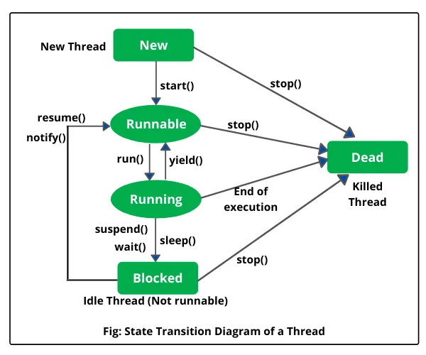

Concurrency is a fundamental concept in modern software development, enabling programs to execute multiple tasks simultaneously for improved efficiency, responsiveness, and scalability. Java provides a rich set of APIs and language features for building concurrent applications.

---

## What is Concurrency?

Concurrency is the ability of a program to execute multiple tasks (threads) seemingly at the same time. In Java, concurrency is achieved by running multiple threads within a single process.

- **Parallelism**: Actual simultaneous execution on multiple processors/cores.
- **Concurrency**: Structuring a program so tasks can be interleaved or run in parallel.

**Benefits:**
- Improved resource utilization
- Better application responsiveness
- Scalability on multi-core systems

---

## Processes vs Threads

- **Process**: An independent executing program with its own memory space.
- **Thread**: A lightweight unit of execution within a process. Threads share the same memory space but have their own call stacks and program counters.

| Aspect      | Process               | Thread               |
|-------------|----------------------|----------------------|
| Memory      | Separate             | Shared (within process) |
| Overhead    | High                 | Low                  |
| Communication | IPC (slow)           | Shared variables (fast) |
| Failure     | Isolated             | May affect others    |

---

## Java Memory Model Basics

The **Java Memory Model (JMM)** defines how threads interact through memory and what behaviors are allowed in concurrent execution.

- **Main memory**: Shared by all threads
- **Working memory**: Each thread has its own working memory (cache)
- **Visibility**: Changes made by one thread may not be immediately visible to others unless properly synchronized
- **Happens-before relationship**: Guarantees visibility and ordering of actions (e.g., via `synchronized`, `volatile`, thread start/join)

---

## Thread Lifecycle

A Java thread goes through several states:

1. **New**: Thread is created but not yet started
2. **Runnable**: Thread is eligible to run (waiting for CPU)
3. **Running**: Thread is executing
4. **Blocked/Waiting**: Thread is waiting for a monitor lock or another thread's action
5. **Timed Waiting**: Waiting for a specified period
6. **Terminated**: Thread has completed execution or was stopped



---

## Thread Creation

### 1. Implementing Runnable
```java
class MyRunnable implements Runnable {
    public void run() {
        System.out.println("Hello from Runnable!");
    }
}

Thread t = new Thread(new MyRunnable());
t.start();
```

### 2. Extending Thread
```java
class MyThread extends Thread {
    public void run() {
        System.out.println("Hello from Thread!");
    }
}

Thread t = new MyThread();
t.start();
```

### 3. Using Callable and Future
```java
import java.util.concurrent.*;

Callable<Integer> task = () -> {
    Thread.sleep(1000);
    return 42;
};
ExecutorService executor = Executors.newSingleThreadExecutor();
Future<Integer> future = executor.submit(task);
System.out.println(future.get()); // blocks until result is available
executor.shutdown();
```

### 4. Using Executors
```java
ExecutorService executor = Executors.newFixedThreadPool(2);
executor.submit(() -> System.out.println("Task 1"));
executor.submit(() -> System.out.println("Task 2"));
executor.shutdown();
```

---

## Code Examples

### Creating Multiple Threads
```java
for (int i = 0; i < 5; i++) {
    Thread t = new Thread(() -> {
        System.out.println(Thread.currentThread().getName());
    });
    t.start();
}
```

### Lambda Expressions (Java 8+)
```java
Runnable task = () -> System.out.println("Running in a thread");
new Thread(task).start();
```

### Thread Naming
```java
Thread t = new Thread(() -> {}, "Worker-1");
t.start();
System.out.println(t.getName()); // Worker-1
```

---

## Best Practices

- Prefer higher-level concurrency utilities (`Executors`, `Concurrent` collections) over manual thread management
- Minimize shared mutable state
- Always properly synchronize access to shared variables
- Use `volatile` for variables accessed by multiple threads without locking (when appropriate)
- Always shut down executors to free resources
- Catch and handle exceptions in threads to avoid silent failures
- Name threads for easier debugging

